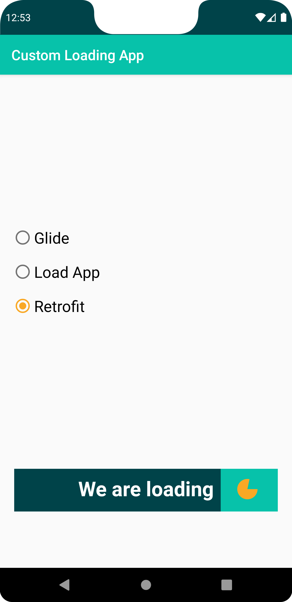
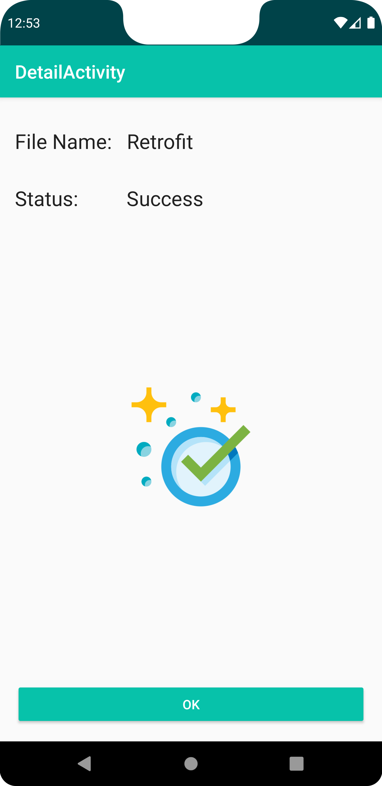
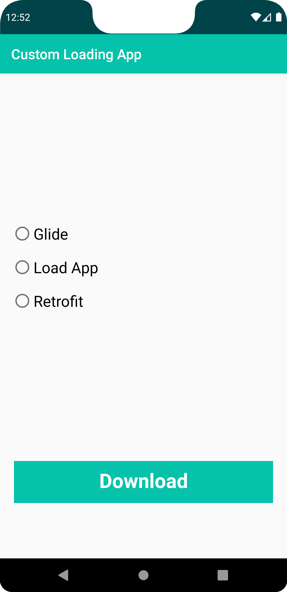
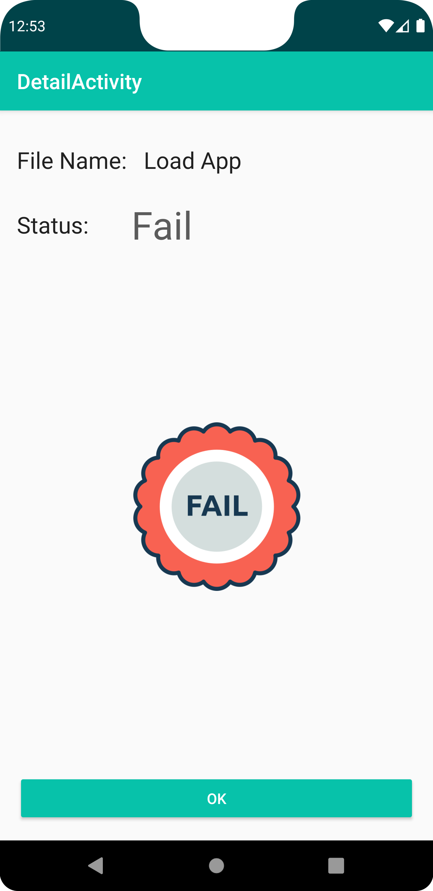

This project is part of the [Android Kotlin Developer Nanodegree](https://github.com/eslammongy/Custom-Downloading-App) from Udacity. 

# Custom Loading App

In this project students will create an app to download a file from Internet by clicking on a custom-built button where:
- width of the button gets animated from left to right;
- text gets changed based on different states of the button;
- circle gets be animated from 0 to 360 degrees

A notification will be sent once the download is complete. When a user clicks on notification, the user lands on detail activity and the notification gets dismissed. In detail activity, the status of the download will be displayed and animated via MotionLayout upon opening the activity.
